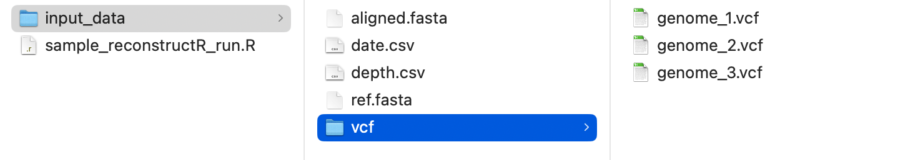

[](https://github.com/broadinstitute/reconstructR/actions)

# reconstructR
Sabeti Lab - Outbreak Reconstruction R Package


## Installation
### Installation of R package
Installing `reconstructR` currently requires installation through GitHub directly. To do this, first you will need to install (if you have not already) and load the package `devtools` in R:
```
install.packages("devtools")
library(devtools)
```

After loading `devtools`, the `reconstructR` package can be installed by running: 
```
install_github("broadinstitute/reconstructR")
```
### Docker images
Docker images are built and provided via [Github Packages](https://github.com/broadinstitute/reconstructR/pkgs/container/reconstructr):
```
docker pull gchr.io/broadinstitute/reconstructr:main
```

## Assembling and formatting data
After you have installed `reconstructR`, you will need to assemble the data that you would like to run and ensure that all of the data are in the correct format. There is also a particular file structure that `reconstructR` currently requires. It is important that your data is formatted exactly as shown in this guide and placed in folders exactly as shown. First, within the directory that you will be doing analysis, create a folder called `input_data`. This folder needs to include: 
 - `ref.fasta`
    - This should be the reference sequence that was used to align all other genomic samples that will be included. The actual name of the sequence in the FASTA file may be anything, but the file itself must be named exactly as above.
 - `aligned.fasta`
    - This should be an aligned FASTA file that contains all of the genomic samples you would like to reconstruct. 
 - `depth.csv`
    - This should be a csv file where the first column is titled \texttt{position} and each subsequent column is titled with the exact name of all genomic sequences in the `aligned.fasta` file. The `position` column should then have entries from 1 to the full length of the reference genome. Each subsequent column should then contain the sequencing read depth of the column's genome at the indicated position. 
    - For example if `aligned.fasta` contained three genomes named `genome_1`, `genome_2`, `genome_3` then `depth.csv` should look like:
      ```
      depth = data.frame(position=1:29903,
         genome_1=round(rnorm(29903,50,10)),
         genome_2=round(rnorm(29903,100,10)),
         genome_3=round(rnorm(29903,70,10)))
      print(head(depth))
      print(tail(depth))
      ```
 - `date.csv`
    - This should be a csv file where the first column contains the exact name of all genomic sequences in the `aligned.fasta` file and the second column contains the number of days between the collection date of each sample and the earliest collected sample. 
    - For example if `aligned.fasta` contained three genomes named `genome_1`, `genome_2`, `genome_3` where `genome_1` was tested first, then `date.csv` should look like:
      ```
      date = data.frame(col1=c("genome_1","genome_2","genome_3"), col2=c(0,2,4))
      print(date)
      ```
 - A folder called `vcf`
    - This folder should contain Variant Call Format (vcf) files for each of the genomic sequences included in `aligned.fasta`. The name of each file should match the exact name of the sequence. Each `.vcf` file should look like:
      ```
      file = read.table('demo.vcf')
      colnames(file) <- c('#CHROM','POS','ID','REF','ALT','QUAL','FILTER','INFO')
      print(head(file))
      ```

Finally, in the directory that you created `input_data` create a new R script, which is where you will run and analyze `reconstructR`. The overall file structure should look as follows: 




## Running `reconstructR`
Once your data is in the format shown above and you have created an R script in the directory that also contains your `input_data` folder, `reconstructR` can be run using default settings as follows: 
```
outbreak_data <- run_mcmc(N_iters = ...)
```

You will need to set `N_iters` to an appropriate number based on the size of your data set. A (very) rough hueristic has been to run 1000 iterations per individual in the outbreak. To run `reconstructR` with custom settings, pass a list to the optional `filters` argument as follows:
```
outbreak_data <- run_mcmc(N_iters = ..., filters = list(
    omit = ..., 
    coverage = ..., 
    sb = ...,
    dp4 = ...,
    af = ..., 
    call = ..., 
    depth = ...,
    problem_qtile = ...
))
```

where:
 - `omit` is a vector of sample names to omit from the reconstruction (defaults to the empty vector)
 - `coverage` is the minimum coverage for samples to include in the analysis (defaults to 0.75)
 - `sb` is the maximum allowable strand bias for an iSNV call to be considered reliable, reported as a phred-scaled $p$-value for Fisher's exact test on the ref-forward, ref-reverse, alt-forward, and alt-reverse read counts. **Only one of** `sb` **or** `dp4` **should be set to its non-default value**, as they mask the same thing. Defaults to `Inf`, assuming we mask for strand bias via the `dp4` argument instead.
 - `dp4` is the minimum allowable $p$-value for Fisher's exact test on the ref-forward, ref-reverse, alt-forward, and alt-reverse read counts. **Only one of** `sb` **or** `dp4` **should be set to its non-default value**, as they mask the same thing. Defaults to 0.5.
 - `af` is the minimum frequency necessary for an iSNV call to be included in our analysis. Defaults to 0.03.
 - `call` is the minimum number of reads of an alternate allele needed for an iSNV call to be included in our analysis. Defaults to 10.
 - `depth` is the minimum number of reads of a site needed for an iSNV call at that site to be included in our analysis. Defaults to 100.
 - `problem_qtile` helps filter out commonly-occurring iSNVs in the SARS-CoV-2 genome. It is defined as follows: suppose we select 1,000 random genomes from a large dataset of over 172,519 SARS-CoV-2 genomes sequenced at the Broad Institute. If the probability that two or more of these genomes contain a given iSNV exceeds `problem_qtile`, then all calls of that iSNV are masked from the reconstruction. Defaults to 0.05. **This argument must be set to 1 if not analyzing SARS-CoV-2 genomes.**


Once you have run the above with an appropriate number of iterations and filters, you can view the results by running
```
visualize(outbreak_data)
tabulate(outbreak_data) 
```

To change the names of samples in outputs back to the sample names in your FASTA, you can run 
```
dechiper(outbreak_data)
```
